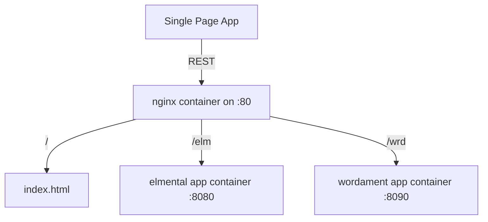

infra
=====
nginx based reverse proxy that is run on my vm

How it works
------------



Build
-----
``` bash
./build.sh
```

Deploy
------
Just this container can be run with below. Since this is a private repo, generate the link to the raw script on github each time

``` bash
sudo bash
curl -fsSL "https://raw.githubusercontent.com/abhinababasu/infra/main/deploy.sh?token=GHSAT0AAAAAAB26S7FFMCSRHQ23PFOQPDTGY4HBHLA" | bash
```

All containers can be deployed with the following. Since this is a private repo, generate the link to the raw script on github each time

``` bash
sudo bash
curl -fsSL "https://raw.githubusercontent.com/abhinababasu/infra/main/deployall.sh?token=GHSAT0AAAAAAB26S7FF6HBIOGDGK77ZO6ZAY4KJKWA" | bash

```